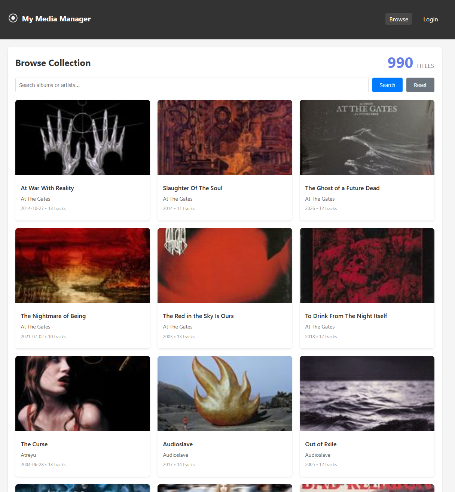

# My Media Manager

A personal music collection manager that imports albums, automatically enriches them with metadata and cover art from MusicBrainz, Discogs, and the Cover Art Archive, and lets you browse and export your collection.



## Architecture

- **Backend**: Strapi 5 (Node.js headless CMS) — REST API, media storage, admin panel
- **Frontend**: Angular 17 — single-page app served as static files
- **Database**: SQLite (development) / MySQL (production)
- **Metadata sources**: MusicBrainz, Discogs, Cover Art Archive, iTunes, Deezer

## Features

- **Add albums** individually (artist, title, UPC, release date, MusicBrainz ID, Discogs ID, optional cover upload) or in bulk via CSV import
- **Automatic metadata enrichment** — fetches release date, track listings, and cover art from MusicBrainz and Discogs after import
- **Cover art** — downloads and stores album covers; thumbnails generated automatically
- **Browse and search** — grid view with cover art, search by artist or title, filter by metadata status or issues (missing covers / failed enrichment)
- **Album detail** — full track listing with track lengths, release date, and links to source records
- **Export** — download your collection as CSV (album summary) or JSON (full album + track data)
- **Advanced tools** — trigger metadata enrichment or cover fetching for the whole collection, view recently added albums, inspect issues

## Demo Site

View the demo site at: https://mmm.restlessmindsstudio.com

## Prerequisites

- Node.js 20–26 and npm

## Local development

### 1. Backend

```bash
cd backend
npm install
```

Copy the example env file and fill in values:
```bash
cp .env.example .env
```

Key variables for development (SQLite is used by default):
```
HOST=0.0.0.0
PORT=1337
APP_KEYS=key1,key2,key3,key4
API_TOKEN_SALT=
ADMIN_JWT_SECRET=
TRANSFER_TOKEN_SALT=
JWT_SECRET=
APP_USER_AGENT=MyMediaManager/1.0 (your-email@example.com)
DISCOGS_TOKEN=          # optional (Discogs metadata)
```

MusicBrainz, Cover Art Archive, iTunes, and Deezer require no credentials. Discogs is optional but improves match quality; set either `DISCOGS_TOKEN` or `DISCOGS_CONSUMER_KEY`/`DISCOGS_CONSUMER_SECRET`.

> **Note**: Spotify support is planned for a future release (a `spotify_id` field already exists on albums).

Generate each secret with:
```bash
node -e "console.log(require('crypto').randomBytes(32).toString('base64'))"
```

Start the backend in development mode (auto-reloads):
```bash
npm run develop
```

- Admin panel: http://localhost:1337/admin (create your admin account on first run)
- API: http://localhost:1337/api

### 2. Frontend

```bash
cd frontend
npm install
npm start
```

The dev server runs at http://localhost:4200 and proxies `/api` and `/uploads` requests to the backend via `proxy.conf.json`.

## Adding albums

### Single album

Use the **Add Albums → Single Album** tab. Artist and title are required; UPC, release date, MusicBrainz ID, Discogs ID, and a cover image are optional. After saving, metadata enrichment runs automatically in the background.

### CSV import

Use the **Add Albums → Import CSV** tab. Format:

```csv
upc,artist,title
782388079327,:wumpscut:,Women And Satan First
016861937027,Obituary,Cause Of Death
745316143323,At The Gates,Slaughter Of The Soul
```

`upc` is optional per row. Metadata is fetched automatically after import.

## API rate limits

- **MusicBrainz**: 1 request/second (required by their terms of service — set a real `APP_USER_AGENT` or requests will be blocked)
- **Discogs**: authenticated requests via `DISCOGS_TOKEN` or consumer key/secret

## Database schema

### Album
| Field | Type | Notes |
|---|---|---|
| `upc` | string | unique, optional |
| `artist` | string | required |
| `title` | string | required |
| `release_date` | string | YYYY, YYYY-MM, or YYYY-MM-DD |
| `cover` | media | stored in `public/uploads/` |
| `mbid` | string | MusicBrainz release ID |
| `discogs_id` | string | Discogs release ID |
| `metadata_status` | enum | `pending` / `fetching` / `completed` / `failed` |

### Track
| Field | Type | Notes |
|---|---|---|
| `track_number` | integer | required |
| `title` | string | required |
| `length` | integer | seconds |
| `album` | relation | belongs to Album |


## Development

### Backend

```bash
cd backend
npm run develop
```

### Frontend

```bash
cd frontend
npm start
```

## Testing

```bash
cd backend
npm test              # all tests (unit + integration)
npm run test:unit     # unit tests only
npm run test:integration
```

Integration tests boot an isolated Strapi instance against a temporary SQLite database (`.tmp/test.db`) — they never touch your development or production data.

## Production deployment

See [DEPLOYMENT.md](DEPLOYMENT.md) for the full guide (nginx, MySQL, pm2, SSL, data migration).

## License

MIT
